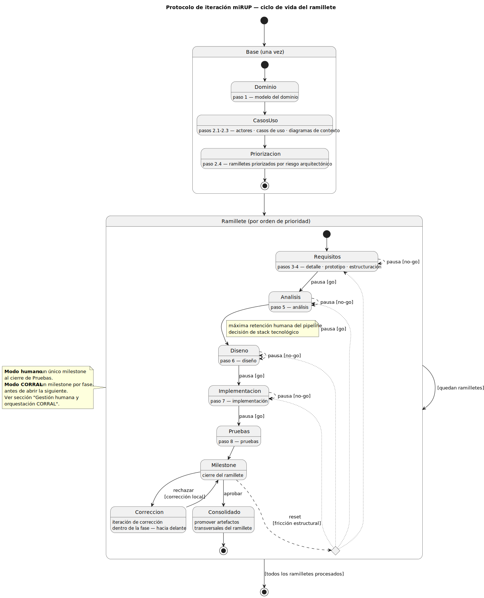
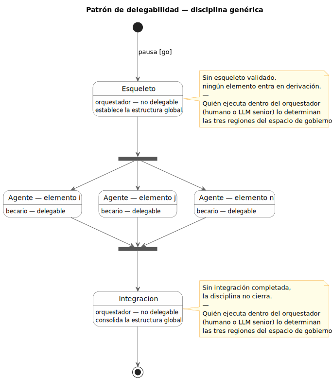
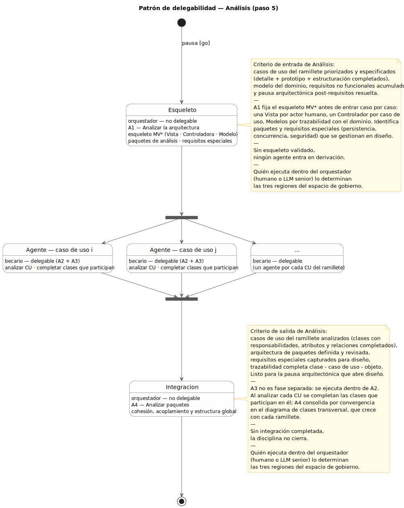
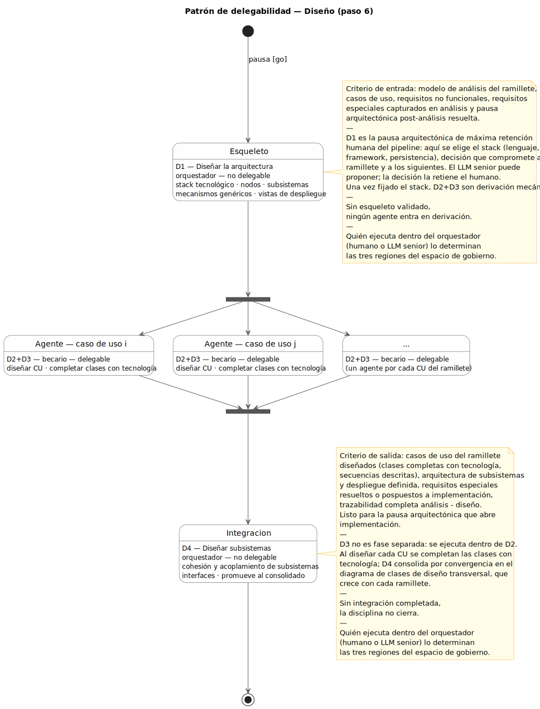
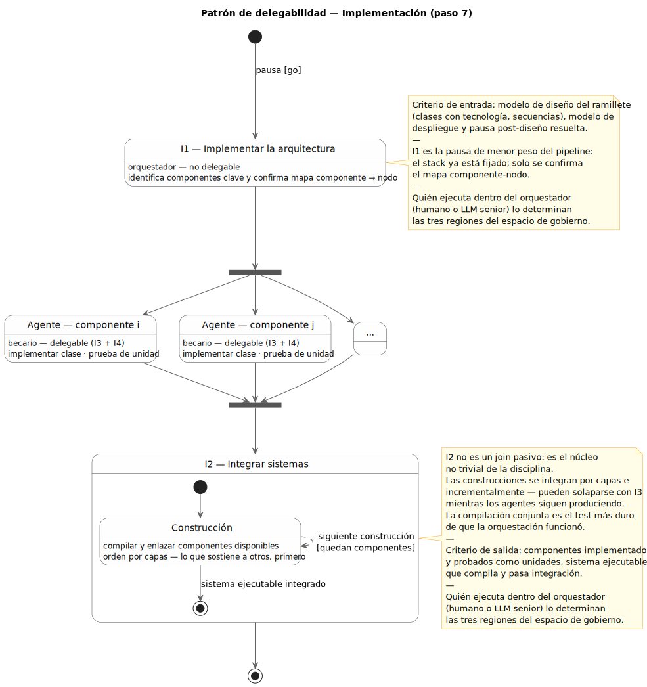
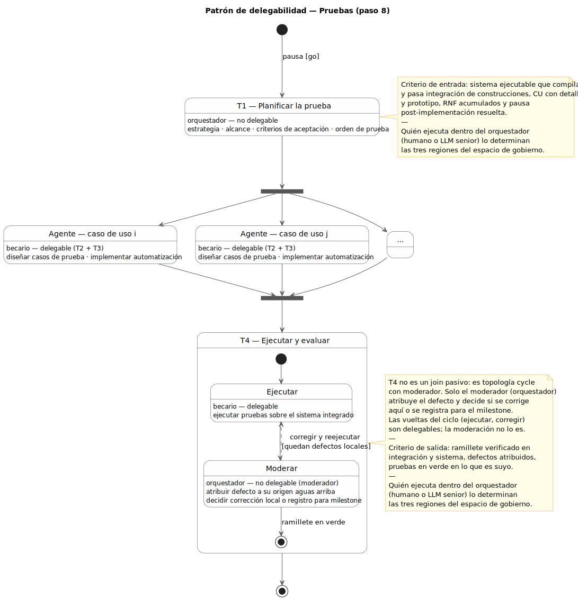

# miRUP

|
|-

---

|
|-
|*Patrón de delegabilidad — disciplina genérica*

---

| Análisis (paso 5) | Diseño (paso 6) |
|---|---|
|  |  |
| Implementación (paso 7) | Pruebas (paso 8) |
|  |  |

